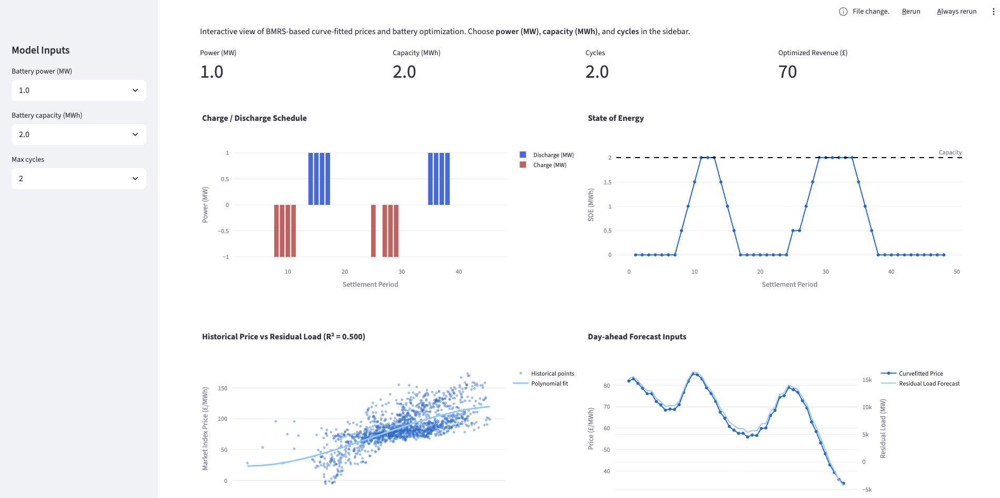

# GB Battery Dispatch Prototype (Modo Take-Home)



A Python-based prototype that answers a practical market question:

> **Given GB demand, wind, and solar conditions, when should a battery charge/discharge to maximise intraday arbitrage revenue under power, capacity, and cycle constraints?**

This repository demonstrates a complete (but intentionally simplified) workflow:

1. Pull historic GB fundamentals and prices from BMRS.
2. Build a simple statistical relationship between residual load and price.
3. Use intraday fundamentals to estimate prices.
4. Optimise battery dispatch against those estimated prices.
5. Explore scenarios interactively in a Streamlit dashboard.

---

## 1) Repository structure

- `app.py` — Streamlit dashboard and interactive scenario controls.
- `bmrs_data_wrapper.py` — BMRS data access + residual load calculations.
- `battery_optimiser.py` — LP-based battery dispatch optimisation.
- `main.py` — non-dashboard script path that runs the same core workflow.
- `historic_actuals.csv` — example output from historical data pull.
- `all_batteries.csv` — example output from batched optimisation runs.
- `take_home_task_open_tech_(2).md` — original brief text.

---

## 2) How to run locally

### Prerequisites

- Python 3.11+ recommended
- A virtual environment (`.venv`)

### Install

```bash
python -m venv .venv
source .venv/bin/activate  # macOS/Linux
python -m pip install --upgrade pip
python -m pip install -r requirements.txt
```

If `requirements.txt` encoding causes issues on your machine, install core packages directly:

```bash
python -m pip install streamlit pandas numpy plotly requests matplotlib pulp
```

### Run dashboard

```bash
source .venv/bin/activate
python -m streamlit run app.py
```

---

## 3) AI usage disclosure

AI tools were used extensively to accelerate implementation and iteration, including Codex, AmpCode, and ChatGPT. The publicly available BMRS API was chosen as the primary data source, and AmpCode was used to write the data wrappers.

Example of prompt given to AmpCode:

> *This is a project in which I intend to build a basic battery with input parameters for the GB energy system.
> For this I will need to pull the data from BMRS. I need to pull the demand, wind, and solar generation data and the intraday prices.
> The base URL for the BMRS website is bmrs.elexon.co.uk.
> Can you please write the code that pulls the wind, solar, and demand
> outturn data for a given date and wrap it up with a for loop that loops from 90 days ago until today?
> Create a file called `bmrs_data_wrapper.py` and dump all this code in there.*

The final repository structure, assumptions, and modelling choices were curated and adapted by hand for this specific task.

### Shortcomings of AI

This was an iterative process with AmpCode — I continued building various blocks of the code via subsequent questions and threads. Most of the code was written by Amp, but there were parts where I had to intervene manually. For instance, when pulling historic wind outturns, Amp mistakenly dropped onshore and offshore wind separately, whereas it should have aggregated them to calculate total wind generation for every settlement period.

---

## 4) Evaluation checklist

### A clear point of view — why did you pick this, what were you trying to find out?

Battery dispatch under variable renewables is one of the core commercial problems in modern power markets. As intermittent generation from wind and solar grows, the value of flexible storage increasingly depends on the ability to anticipate price movements driven by the supply–demand balance. This project asks whether a lightweight, fundamentals-driven price model can produce actionable dispatch signals — and whether that workflow can be scoped, built, and demonstrated end-to-end within a few hours.

### Sensible scoping — did you make smart choices about what to build in the time available?

Yes. The project deliberately constrains itself to publicly available BMRS data, a transparent polynomial curve fit (residual load → price), and a standard LP optimisation for battery scheduling. Each component is simple enough to build, test, and present quickly, while still forming a coherent pipeline from raw market data to an interactive dispatch dashboard. Features that would add complexity without proportional insight — such as multi-market co-optimisation, degradation modelling, or probabilistic forecasting — were intentionally deferred.

### Quality of thinking — is the analysis or output defensible and clearly communicated?

The model is intentionally simple, and every simplification is stated explicitly (see Section 5). The dashboard makes assumptions, data flow, and outputs visible so a reviewer can trace each step from input data to dispatch schedule. The polynomial fit is not presented as a production forecasting tool — it is a directional proxy that demonstrates how fundamentals-based price estimation feeds into constrained optimisation.

### Energy market awareness — does it reflect an understanding of how these markets actually work?

Yes. The prototype incorporates key real-world concepts: the demand/renewables balance as a driver of price, half-hourly settlement-period granularity, and operational battery constraints (power limits, energy capacity, cycle throughput). It acknowledges — through its stated assumptions — the gap between this simplified model and real trading decisions, including multi-market participation, imbalance exposure, efficiency losses, and bid/offer spread risk.

### Use of AI

Use of AI is not just allowed — it's expected. AI tools (AmpCode, Codex, ChatGPT) were used throughout to move faster, iterate on code, and build a complete prototype that would have taken significantly longer to deliver without them. The AI usage disclosure in Section 3 details the workflow, including an example prompt and where manual intervention was required.

---

## 5) Key simplifying assumptions

This is a prototype for rapid insight, not a production trading model. Important simplifications include:

1. Price is modelled as a univariate function of residual load.
2. Polynomial fit is static over the chosen lookback period.
3. We assume a single intraday market, where in reality the optimisation decision is complex across multiple markets.
4. No explicit battery degradation cost, efficiency losses, or bid/offer spreads.
5. No imbalance risk, constraint/basis risk, or market liquidity impacts.

These assumptions are deliberate to keep the model interpretable and implementable within a short take-home timeframe.
